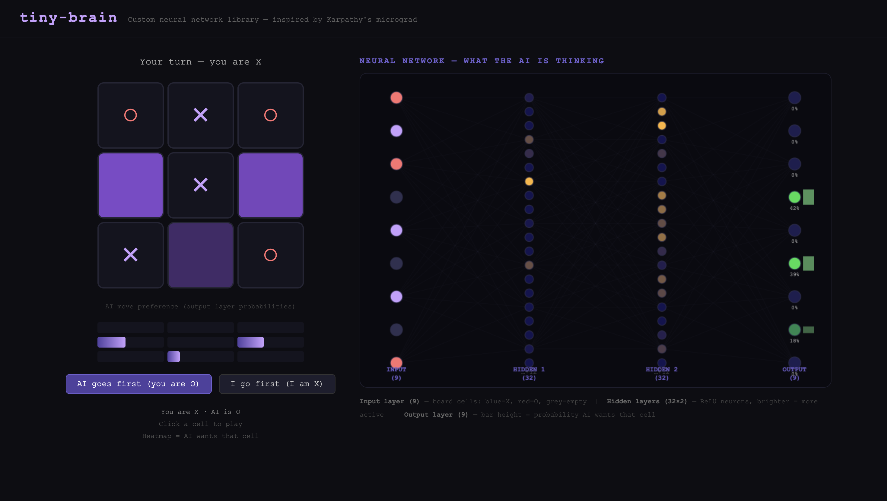
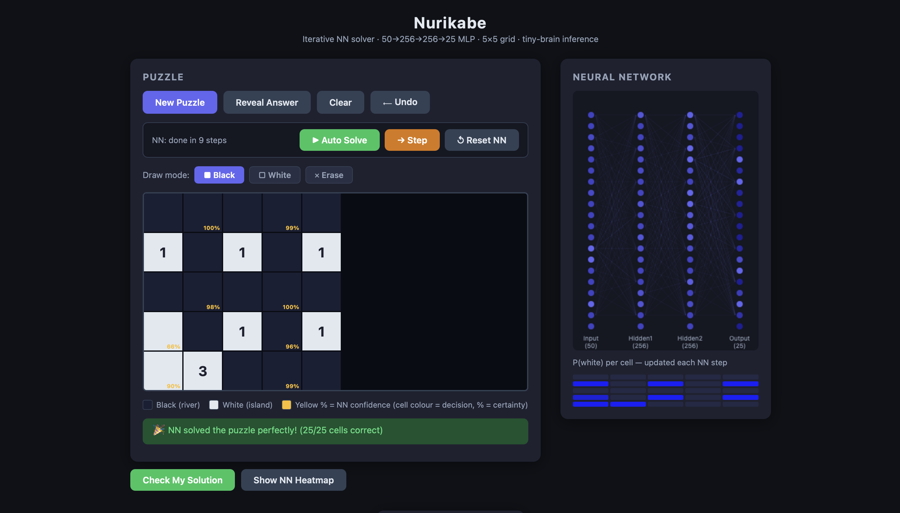

# tiny-brain

A from-scratch neural network library — pure Python, zero dependencies.
Inspired by Andrej Karpathy's [micrograd lecture](https://youtu.be/VMj-3S1tku0).

Two games with **live neural network visualizers** in the browser: TicTacToe and Nurikabe.

---

## TicTacToe



*Left: board with purple heatmap showing where the AI wants to play. Right: live NN diagram — neurons light up by activation strength, output layer shows move probabilities.*

---

## Nurikabe



*Iterative NN solver for 5×5 Nurikabe puzzles. The NN locks one cell at a time (most confident first), feeding each decision back as input for the next step. Yellow percentages show confidence. Right panel: live 50→256→256→25 MLP activations.*

---

## What's inside

```
tinybrain/              Core library (pure Python, no deps)
  engine.py             Value class — scalar autograd engine
  nn.py                 Neuron, Layer, MLP

demo.py                 Karpathy-style validation (run this first)

games/tictactoe/
  game.py               Board logic
  agent.py              NNAgent wrapping MLP
  train.py              REINFORCE training loop
  server.py             Flask web app (game + brain visualizer)
  templates/index.html  Browser UI

games/nurikabe/
  puzzle.py             5×5 puzzle generator + validator
  agent.py              NurikabeAgent — iterative MLP solver
  train_pytorch.py      PyTorch training (MPS/CUDA/CPU), exports to tiny-brain format
  agent.pkl             Trained weights (750 KB, 15% full-puzzle accuracy)
  server.py             Flask web app (step-by-step solver + brain visualizer)
  templates/index.html  Browser UI with undo, manual drawing + NN mixing
```

---

## Quickstart

```bash
# 1. Install dependencies
pip install flask torch

# 2. Validate the core library
python demo.py

# 3. Play TicTacToe
python games/tictactoe/train.py
python games/tictactoe/server.py
# → open http://localhost:5000

# 4. Play Nurikabe (trained weights included)
python games/nurikabe/server.py
# → open http://localhost:5001

# 5. Re-train Nurikabe (optional, ~7 min on Apple Silicon)
python games/nurikabe/train_pytorch.py
```

---

## How it works

### The autograd engine (`engine.py`)

Every number is wrapped in a `Value` object. When you do math with `Value`s,
a computation graph is built silently in the background. Calling `.backward()`
on the final result walks the graph in reverse, computing how much each
input contributed to the output — that's the gradient.

```python
from tinybrain import Value

a = Value(2.0)
b = Value(-3.0)
c = a * b + Value(10.0)   # builds a graph
c.backward()

print(a.grad)   # dc/da = b = -3.0
print(b.grad)   # dc/db = a =  2.0
```

### The MLP (`nn.py`)

```python
from tinybrain import MLP

model = MLP(2, [16, 16, 1])   # 2 inputs → 2 hidden layers → 1 output
out = model([1.0, -1.0])      # forward pass, returns a Value
out.backward()                # compute all gradients
model.zero_grad()             # reset before next step
```

### Training TicTacToe

The agent uses **REINFORCE** (policy gradient):
1. Play a full game, recording `(log_prob_of_action, reward)` for each move
2. Win = +1, Draw = 0, Lose = -1
3. `loss = -sum(log_prob * advantage)` where `advantage = reward - running_mean`
4. `loss.backward()` flows gradients through the entire network
5. SGD nudges weights to make winning moves more likely

### Training Nurikabe

The agent uses **supervised iterative training**:
1. Generate a solved puzzle, randomly reveal 0–20 already-solved cells as partial state
2. Input: 50 floats = clue channel (25) + state channel (25, values +1/−1/0)
3. Target: full 25-cell solution; loss = BCEWithLogitsLoss
4. At inference, lock the most-confident unknown cell, feed it back, repeat
5. Trained with PyTorch (Adam + CosineAnnealingLR), weights exported to tiny-brain MLP format

---

## The brain visualizer

Both games show the neural network thinking in real time:

**TicTacToe**
- **Input layer** (9 neurons) — board cells: purple=X, red=O, dark=empty
- **Hidden layers** (32 neurons each) — brightness = how strongly each neuron fires
- **Output layer** (9 neurons) — move probabilities

**Nurikabe**
- **Input layer** (50 neurons) — clue channel + state channel
- **Hidden layers** (256 neurons each) — activation strength
- **Output layer** (25 neurons) — P(white) per cell
- **Prob mini-grid** — colour-coded island probability for each cell

---

## Adding new games

The `tinybrain/` library is game-agnostic. To add a new game:
1. Create `games/<your_game>/`
2. Import `MLP` from `tinybrain`
3. Build an agent, a training loop, and a Flask server
